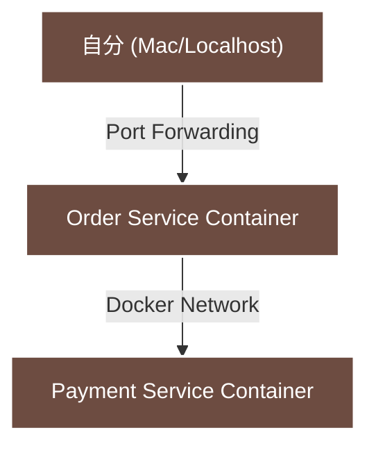
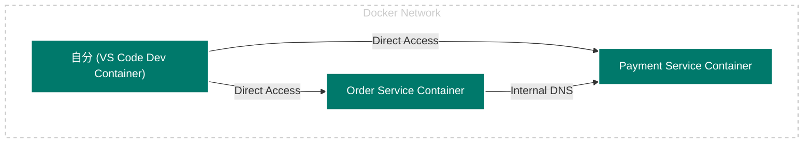

## はじめに

「vscode 拡張機能の Dev Containers って便利そうだよね。環境構築がコマンド一発で終わるんでしょ？」

正直、導入するまで私の認識はこの程度でした。
しかし、実際にマイクロサービスの検証環境を作ってみて、その認識は **完全に間違っていた（浅かった）** と気づきました。

Dev Containers の真価は、「環境構築が楽になること」ではありません。
**「自分自身が Docker ネットワークの内側に入り込んで開発できること」**。これこそが本質でした。

今回は、Dev Containers を使ったマイクロサービス開発を通して得た、「今世紀最大の気づき（大袈裟）」を共有します。

## アーキテクチャ図で見る違い

**Before: 従来の開発 （以前の記事）**

https://zenn.dev/shayate811/articles/microservices-saga-poc

自分は「壁の外」にいて、小さな窓（ポート）から中を覗いている状態。



**After: コンテナの中の世界 （本記事）**
自分も「壁の中」に入り、各サービスと対等な位置にいる状態。サービス名で通信する Kubernetes の要になる考え方。

https://github.com/shayate811/DevContainersLearning



## これまでの誤解： "外" からの操作

Dev Containers を使う前（普通の `docker-compose` 利用時）、私は無意識に以下のような開発スタイルをとっていました。

1. `docker-compose up -d` でコンテナ群を起動。
2. ホスト PC（Mac）のターミナルから `curl` で動作確認。

```bash
# Macのターミナルから実行
$ curl http://localhost:8000/orders/
```

これは「ポートフォワーディング（穴あけ）」機能を使って、コンテナのポートを Mac 側の localhost に繋げている状態です。 一見これで問題ないように見えますが、マイクロサービス開発ではここで **致命的な「ねじれ」** が発生します。

「localhost」はコード内で使えない

開発中のテストで localhost を使っていると、いざ Python コードを書く時に混乱します。

```python
# ❌ これは動かない
# コンテナ内で "localhost" と言うと「自分自身」を指してしまう
requests.post("http://localhost:8001/payments/")

# ✅ 本来書きたいコード（本番と同じ）
# DockerのDNS（サービス名）で相手を指定する
requests.post("http://payment-service:8001/payments/")
```

つまり、「テストしている環境（localhost）」と「実際に動くコード（サービス名）」で、通信の宛先がズレてしまうのです。

## Dev Containers 導入後の世界："中"への没入

Dev Containers を使って Reopen in Container した瞬間、世界が変わりました。 VS Code がコンテナの中にインストールされ、私自身（開発者）が Docker ネットワークの住人になったのです。

何が変わったか？
もう localhost という抜け道を通る必要はありません。 VS Code のターミナルから、隣のコンテナ（サービス）に名前で話しかけることができます。

```bash
# Orderサービスのコンテナ内（Dev Container）から実行
# "localhost" ではなく "サービス名" で通じる！
$ curl http://payment-service:8001/
```

これにより、「開発中に手動で叩く curl コマンド」と「Python コードが内部で実行する通信」が完全に一致します。 「本番と同じ経路」で開発・テストができる。これがこれほど快適で、安心感があるとは思いませんでした。

## もう一つの学び

「コンテナの中に入ってしまうと、コンテナの再起動とかログ確認ができなくて不便じゃない？」 という不安もありましたが、これも杞憂でした。

devcontainer.json に以下の魔法（Features）を 1 行足すだけです。

```json
"features": {
    "ghcr.io/devcontainers/features/docker-outside-of-docker:1": {}
}
```

これを有効にすると、コンテナの中から、ホスト側の Docker を操作できるようになります。 Order コンテナの中にいながら、調子の悪い Payment コンテナを再起動する。

```bash
# Orderコンテナ内のターミナルで実行
$ docker restart payment-service
```

いちいちターミナルを切り替えたり、迷子になったりすることがなくなりました。

## まとめ: 「開発者をネットワーク内に移住させるツール」

今回の検証を通して、Dev Containers を導入する意義が明確になりました。

環境の隔離 (Isolation): サービスごとに拡張機能やライブラリを完全に分けられる（Python 環境と Java 環境が混ざらない）。

IaC (Infrastructure as Code): 「動いた」ではなく「コード化した」環境だけが正義。Rebuild して消えるものは、本来そこにあってはいけないもの。

ネットワークの同一性: localhost ではなく「サービス名」で通信する癖がつく。これが将来的に Kubernetes などへ移行する際の基礎体力になる。ただ K8s に行くと DNS キャッシュ、ヘルスチェック、Sidecar、Retry、Circuit Breaker が入って、通信経路はもっとゴツい（？）

「Dev Containers = 環境構築ツール」だと思っている人がいたら、ぜひ一度 **「マイクロサービス構成」** で使ってみてほしいです。 「あ、今自分はネットワークの中にいる」 と感じる瞬間、開発体験がガラッと変わるはずです。
