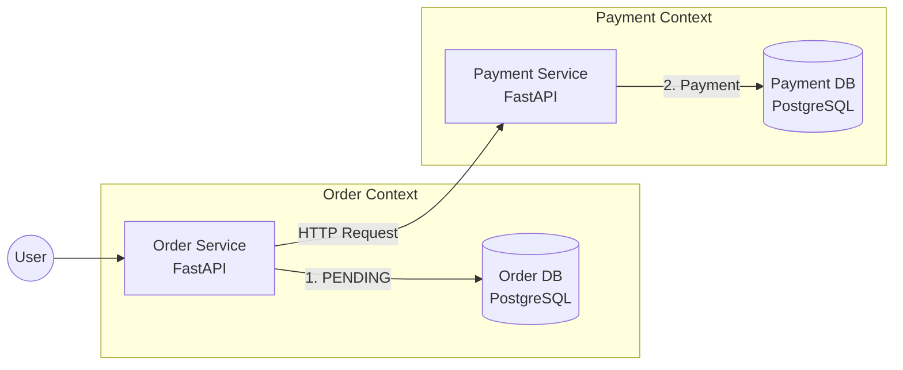

## はじめに：モノリスの「安心感」は失われた

こんにちは。現在、26 卒として IT 企業（テクノロジーアーキテクト職）への入社を控えている学生です。
現在、『ソフトウェアアーキテクチャの基礎』などの書籍を通じてアーキテクチャ設計を学んでいます。その中で、マイクロサービスにおける最大の難関の一つとして **「分散トランザクション」** が挙げられていました。

モノリス（単体アプリケーション）の時代、データの整合性を守るのは簡単でした。RDBMS の強力なトランザクション機能（ACID 特性）があり、エラーが起きれば `ROLLBACK` 一発ですべてを無かったことにできました。

しかし、DB が分割されるマイクロサービスでは、**「サービス A（注文）のコミット」と「サービス B（決済）のコミット」を同時に保証する魔法（グローバルトランザクション）は存在しません。**

「じゃあ、決済が失敗したら、確定してしまった注文データはどうなるの？」

この恐怖と向き合うため、Python（FastAPI）と Docker を使って **「Saga パターン（オーケストレーション）」** による補償トランザクションを実装し、実際にシステムを一部クラッシュさせて挙動を検証してみました。

## 今回構築したアーキテクチャ

https://github.com/shayate811/microservices-saga-poc

**「Database Per Service」** パターンを厳守し、注文サービスと決済サービスが完全に分離した構成を作成しました。



## 技術スタック

App: Python 3.11 (FastAPI)

DB: PostgreSQL 15 (x2 instances)

Infra: Docker Compose

ORM: SQLAlchemy 2.0 (Async/Sync hybrid)

## 実験シナリオ：9999 円の爆弾

Saga パターンが正しく動くか確認するため、以下のシナリオを用意しました。

注文サービスで注文を受け付ける（DB に PENDING で保存）。

決済サービスを呼び出す。

決済サービスに「9999 円」のリクエストが来た場合、意図的にサーバーエラー(500)を発生させる。

注文サービスがエラーを検知し、**「補償トランザクション（Compensating Transaction）」** を実行して注文を取り消す（CANCELLED に更新）。

いわゆるカオスエンジニアリング的なアプローチです。

実装のポイント（コード抜粋）
オーケストレーターとなる Order Service の実装です。 「DB への書き込み」と「API 呼び出し」が分かれているため、アプリ側で整合性を担保するロジックを書いています。

```python
@app.post("/orders/")
async def create_order(order: schemas.OrderCreate, db: Session = Depends(get_db)):
    # 1. ローカルTX: まず自分のDBに「PENDING」で書き込む
    # ここでコミットされるため、後でエラーが起きてもこのレコードは消えない！
    new_order = services.create_order(db=db, order=order)

    # 2. 外部サービス呼び出し
    # 決済サービスへHTTPリクエスト（ここでネットワークエラー等が起きうる）
    payment_success = await services.request_payment(order_id=new_order.id, amount=order.price)

    # 3. Sagaロジック: 結果に応じた事後処理
    if payment_success:
        # 成功時: ステータスを完了にする
        services.update_order_status(db, new_order.id, "COMPLETED")
    else:
        # 【重要】失敗時: 補償トランザクション (Compensating Transaction)
        # これを書かないと「商品は確保したのに金が払われていない」状態になる
        services.update_order_status(db, new_order.id, "CANCELLED")

        raise HTTPException(status_code=400, detail="Payment failed, Order cancelled")

    return new_order
```

## 検証結果：ログで見る「整合性が守られた瞬間」

実際に curl コマンドで 9999 円の注文（爆弾）を投げてみました。

```bash
$ curl -X POST "http://localhost:8000/orders/" \
     -H "Content-Type: application/json" \
     -d '{"item_name": "Ghost", "quantity": 1, "price": 9999}'

# レスポンス
{"detail":"Payment failed, Order cancelled"}
```

API としては 400 エラーが返ってきましたが、重要なのは **「裏で何が起きたか」** です。 Docker コンテナのログを確認すると、Saga パターンの挙動が完璧に記録されていました。

実際のログ（抜粋）

```
# 1. 注文発生: ステータス PENDING で INSERT (コミット完了)

INFO sqlalchemy.engine.Engine INSERT INTO orders ... VALUES (..., 'PENDING') RETURNING orders.id
INFO sqlalchemy.engine.Engine COMMIT

# 2. 決済サービス呼び出し -> 500 エラー発生

order-service | Payment failed: Server error '500 Internal Server Error' for url 'http://payment-service:8001/payments/'

# 3. 補償トランザクション発動: ステータスを CANCELLED に UPDATE

INFO sqlalchemy.engine.Engine UPDATE orders SET status='CANCELLED' WHERE orders.id = 2
INFO sqlalchemy.engine.Engine COMMIT
```

もし Saga を実装していなかったら？
コード内の else ブロック（補償処理）をコメントアウトして同じ実験をしたところ、DB には ステータス PENDING（注文有効）のレコードが残ってしまいました。

これは実業務で言えば **「在庫引当はされているのに、お金は払われていない」** という最悪のデータ不整合（Inconsistency）です。マイクロサービスにおいて、いかにアプリケーション層でのハンドリングが重要かを痛感しました。

## まとめ：アーキテクトとしての学び

今回の PoC を通じて、以下の学びがありました。

ACID から BASE への頭の切り替え マイクロサービスでは「常に整合性が取れている（Strong Consistency）」状態を維持するのは困難です。「最終的に整合性が取れる（Eventual Consistency）」状態を設計の前提にする必要があります。

失敗を前提にした設計（Design for Failure） 「ネットワークは切れる」「相手のサーバーは落ちる」という前提で、正常系だけでなく異常系の回復ロジック（Saga）を組むコストがかかります。

アーキテクチャはトレードオフ マイクロサービス化すればスケーラビリティや開発速度は上がりますが、今回のように「データ整合性を守るための複雑さ」というコストを支払うことになります。

本やドキュメントを読むだけでなく、実際に「不整合」を起こし、それをコードで解決する経験は非常に有意義でした。次は非同期メッセージング（Kafka/RabbitMQ）を使った、より疎結合な Saga パターン（コレオグラフィ）にも挑戦してみたいと思います。
